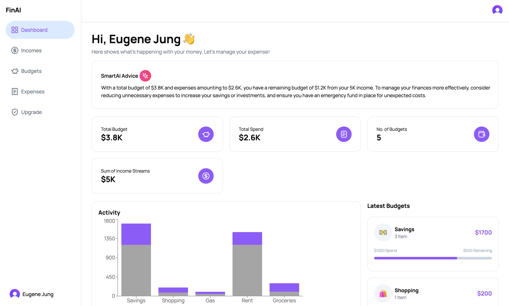

<div align="center">
<p float="left">
  
   
</p>

  <div>
    
    
    
    
    
    
  </div>

  <h3 align="center">FinAI: AI-Powered Personal Finance Advisor</h3>
</div>

### 📋 <a name="table">Table of Contents</a>

1. 🌱 [Introduction](#introduction)
2. ⚙️ [Tech Stack](#tech-stack)
3. ⚡️ [Features](#features)
4. 🏁 [Quick Start](#quick-start)
5. 🚀 [Future Improvements](#future)

---

### <a name="introduction">🌱 Introduction</a>

Welcome to FinAI, your AI-powered personal finance advisor. FinAI leverages the latest advancements in AI and web technologies to provide personalized financial insights, helping users manage their income, expenses, and budgets effectively. Built with Next.js and TypeScript, FinAI integrates the OpenAI API to deliver real-time, customized financial advice, making it easier than ever to stay on top of your finances.

---

### <a name="tech-stack">⚙️ Tech Stack</a>

- Next.js
- Typescript
- OpenAI API
- Clerk
- Tailwind CSS
- PostgreSQL

---

### <a name="features">⚡️ Features</a>

- **Income and Expense Management**: Easily input, edit, and delete income and expense records.
- **Budget Tracking**: Visualize your budgets and track spending with detailed graphical data.
- **Personalized Financial Advice**: Receive tailored financial advice based on your specific financial data, powered by OpenAI's GPT-4 model.
- **Responsive Design**: Enjoy a seamless user experience across all devices, ensuring accessibility and ease of use on mobile, tablet, and desktop.

---

### <a name="quick-start">🏁 Quick Start</a>

```bash
# Clone the project
$ git clone https://github.com/jung-eugene/finai
$ cd finai

# Install dependencies
$ npm install

# Set up environment variables in .env
NEXT_PUBLIC_CLERK_PUBLISHABLE_KEY=your_clerk_publishable_key
CLERK_SECRET_KEY=your_clerk_secret_key

NEXT_PUBLIC_CLERK_SIGN_IN_URL=/sign-in
NEXT_PUBLIC_CLERK_SIGN_UP_URL=/sign-up
NEXT_PUBLIC_CLERK_AFTER_SIGN_IN_URL=/
NEXT_PUBLIC_CLERK_AFTER_SIGN_UP_URL=/

NEXT_PUBLIC_OPENAI_API_KEY=your_openai_api_key
NEXT_PUBLIC_DATABASE_URL=your_database_url

# Serve with hot reload at localhost:3000
$ npm run dev
```

---

### <a name="future">🚀 Future Improvements</a>

- **Advanced Features for Paid Plans**: Introduce a premium plan with advanced budgeting and forecasting tools.
- **Enhanced Navigation**: Integrate a search bar at the top for easy navigation throughout the app.
- **Dark Mode**: Implement a dark mode to improve visuals and provide a better user experience in low-light environments.
- **Multi-Currency Support**: Enable support for multiple currencies to cater to a global user base.
- **Mobile App**: Develop a mobile application to offer users on-the-go access to their financial data and advice.
